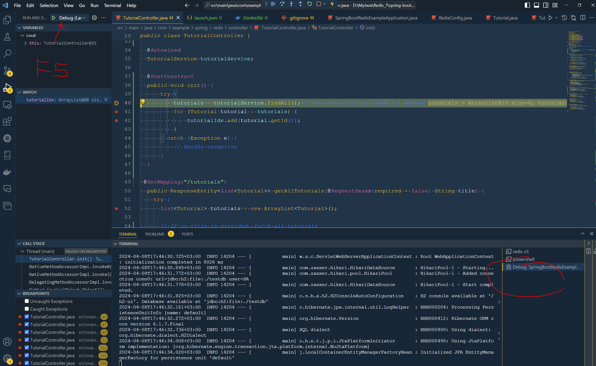
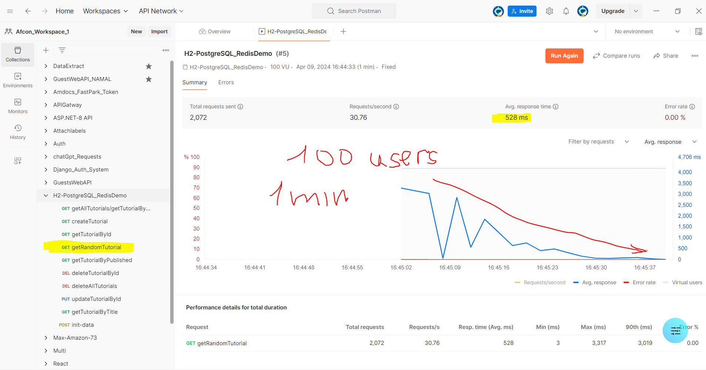

# Spring Boot Redis example

Add Redis Cache into your Spring Boot Application (CRUD example) using `spring-boot-starter-data-redis`.


## Run Spring Boot application
```bash
 ./mvnw.cmd clean install

 ./mvnw spring-boot:run -X
```

# ATTENTION !!!
To be able to receive your requests with status 200, you need to be running Redis. Otherwise, you will get internal exceptions (status 500) because requests run simultaneously for the main and cache databases.

#
The `testdb.mv.db` file is a H2 database file.

H2 is a lightweight, in-memory database written in Java.

It can be embedded in Java applications or run in client-server mode.


The h2 database will contain the data:


# Run Docker Desktop
then
```bash
docker-compose up
```

 If you want to run the services in the background (detached mode), you can use the `-d` option:

```bash
docker-compose up -d
```

To receive PING-PONG verified access to redis:
```bash
docker exec -it redis-stack redis-cli
127.0.0.1:6379> PING
PONG
127.0.0.1:6379>
```

Stop redis
```bash
exit
docker stop redis-stack
```

Start redis again
```bash
docker start redis-stack
docker exec -it redis-stack redis-cli
```

To see running redis container (for Windows OS):
```bash
docker ps -a | Select-String "redis"
```


Once you're in the Redis CLI, you should just use `FLUSHDB` or `FLUSHALL` directly.
```bash
127.0.0.1:6379> KEYS *
1) "tutorials::SimpleKey []"
2) "tutorial::53"
```

# Import test collection to your Postman:
H2-PostgreSQL_RedisDemo.postman_collection.json


# To switch between using PostgreSQL and H2 as main database
Comment/uncomment lines related to those databases into
./resources/application.properties file
The pom.xml contains already dependencies for both them.

## Debugging in VSCode.

I recommend using the <span style="background-color: yellow; color:black">Debugger for Java<span> extension for Visual Studio Code.
It's an excellent tool for debugging Java applications and it's maintained by Microsoft, ensuring good integration with Visual Studio Code.
Click on the Extensions view icon on the Sidebar (or press `Ctrl+Shift+X`).
In the Extensions view, enter "Debugger for Java" in the search box.
In the search results, find "Debugger for Java" by Microsoft and click on the Install button.

#

To open \.vscode\launch.json go "Run and Debugging" (Ctrl +Shift + D) in VSCode
Select option "Add Configuration" from the combo-box at the top.
Add the following configuration:
```bash
{
    "version": "0.2.0",
    "configurations": [
        {
            "type": "java",
            "name": "Debug (Launch)",
            "request": "launch",
            "mainClass": "com.example.spring.redis.SpringBootRedisExampleApplication",
            "args": ""
        }
    ]
}
```


Open the `settings.json` file in VS Code, follow these steps:

1. Press `Ctrl+Shift+P` to open the Command Palette.
2. Type "Open Settings (JSON)" and select the command when it appears.

    This will open your user `settings.json` file. If you want to open the workspace `settings.json` file (which is specific to your current workspace), you can do the following:

    **<span style="background-color: yellow; color:black">Type "Preferences: Open Workspace Settings" and select the command when it appears</span>**

3. In the Workspace tab that opens, click on the `{}` icon in the top right corner to switch to the JSON view.

    In the `settings.json` file, you can add or modify settings.
    Open the  /path/to/your/workspace/.vscode/settings.json, enter the following:
    ```bash
    {
        "java.project.referencedLibraries": [
            "./lib/**/*.jar"
        ]
    }
    ```
4. **VS Code needs to be reloaded**: Try reloading VS Code. You can do this by pressing `Ctrl+Shift+P` to open the Command Palette, typing <span style="background-color: yellow; color:black">"Reload Window"</span>, and selecting the "Developer: Reload Window" command.



## Postmen (Performance) runner test.
