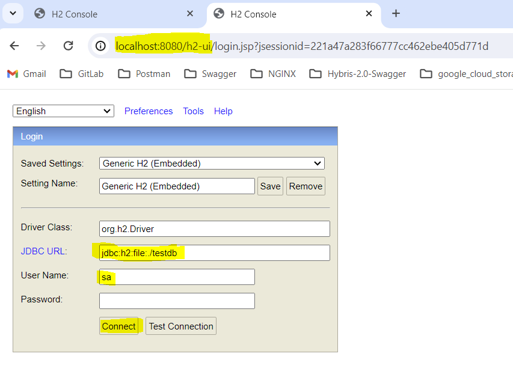
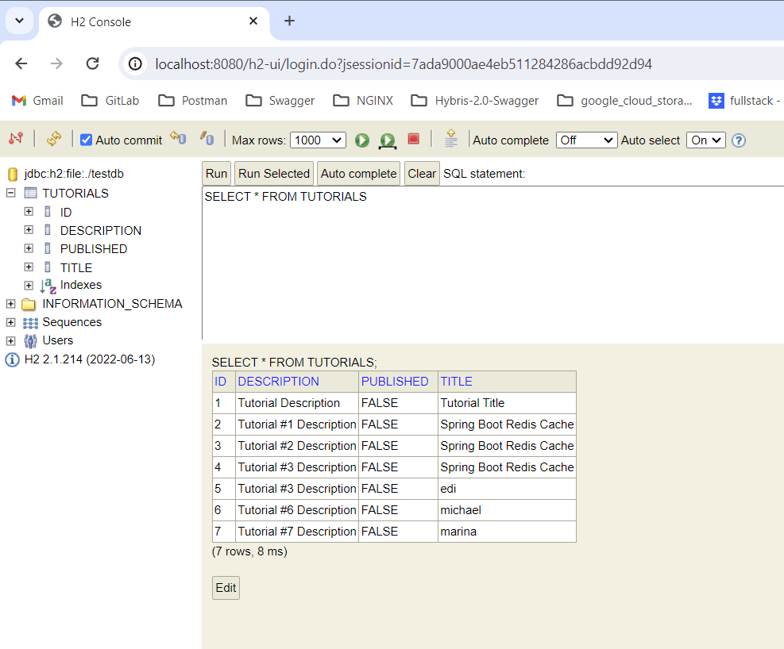

# Spring Boot Redis example

Add Redis Cache into your Spring Boot Application (CRUD example) using `spring-boot-starter-data-redis`.


## Run Spring Boot application
```
 .\mvnw.cmd clean install

 ./mvnw spring-boot:run -X
```

The `testdb.mv.db` file is a H2 database file.

H2 is a lightweight, in-memory database written in Java.

It can be embedded in Java applications or run in client-server mode.



The h2 database will contain the data:




# Run Docker Desktop
then
```bash
docker-compose up
```

 If you want to run the services in the background (detached mode), you can use the `-d` option:

```bash
docker-compose up -d
```

To receive PING-PONG verified access to redis:
```bash
docker exec -it redis-stack redis-cli
127.0.0.1:6379> PING
PONG
127.0.0.1:6379>
```

Once you're in the Redis CLI, you should just use `FLUSHDB` or `FLUSHALL` directly.
```bash
127.0.0.1:6379> KEYS *
1) "tutorials::SimpleKey []"
2) "tutorial::53"
```

# Import test collection to your Postman:
H2-PostgreSQL_RedisDemo.postman_collection.json


# To switch between using PostgreSQL and H2 as main database
comment/uncomment lines related to those databases into
./resources/application.properties file
The pom.xml contains already dependencies for both them.